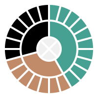

# Circular Sector

A set of functions computing cartesian coordinates, describing circular and annular sectors.

Usable for drawing circular things on ex. `svg` and `canvas` elements, but not bound to either of them.

Great for circular visualisations like spread, progress and reticulated splines. 

## Install

`npm install @casko/circular-sector`

## Demo  

A demo can be found [here](https://hallojoe.github.io/circular-sector/)

## Inline Examples 

Examples generated using this thing:

### Circular Sectors 

### Annular sectors

### Circular sectors with margin

### Annular sectors with margin

### UN World Goals logo

### Ethics Compas

 

## Usage

See repository `./demo` folder for examples.

## Todo

  - ~~Add links to demo~~
  - Center of mass and gravity

# Notes

 - 1.0.0 - Init
 - 1.0.1 - Update demo and minimize readme.

## See you

Thanks for getting this far. Please share result of usage.

Written in TypeScript.

